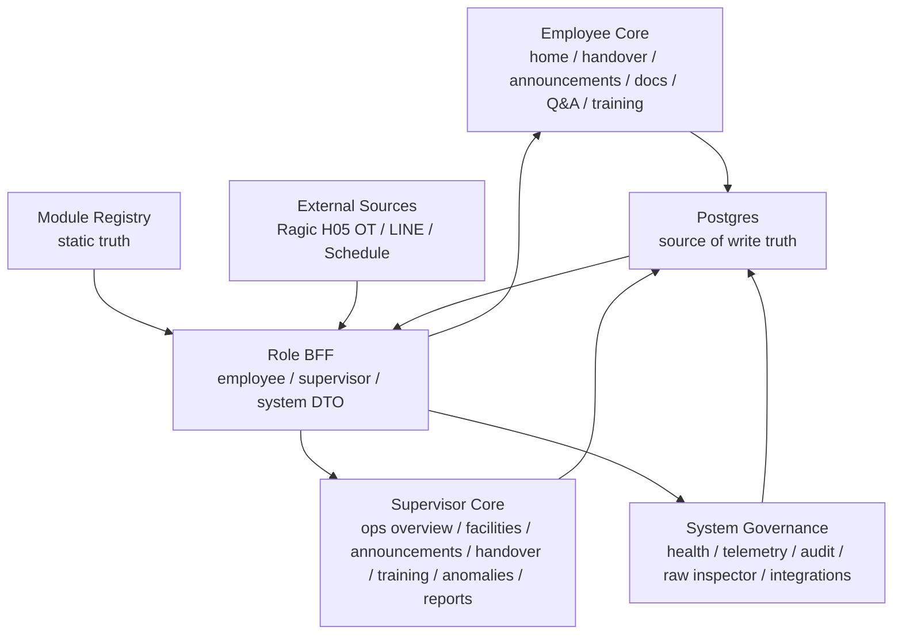

# Current Progress and Remaining Plan

Date: 2026-05-19

## Product Scope Decision

`/supervisor/settings` is removed from the current product surface.

Reason:

- The widget/module configuration experience cannot currently reach the desired quality bar.
- A partial settings builder would create operational confusion and increase support risk.
- The existing domain modules should be stabilized before exposing configuration controls.

Retained only for compatibility:

- `widget_layout_settings` table
- `/api/portal/layout-settings` legacy endpoints
- `widget-layout-settings` registry entry marked as deprecated/background-only

Not in the near-term plan:

- Supervisor settings page
- Widget layout builder
- Module config CRUD
- Role-specific layout editor

## Current State by Role

Role homepage/navigation alignment is complete locally:

- Employee navigation: 9 modules; homepage: 15 cards.
- Supervisor navigation: 13 modules; homepage: 16 cards.
- System navigation: 8 modules; homepage: 8 cards.
- `npm run unit:modules` and `npm run dry-run` both pass with exact order checks.
- Any remaining non-ready health rows are external-provider, background-governance, deprecated, or deployment-validation items; they are not promoted to fake ready state without real source data.

Pre-launch final closure batch status:

- Completed: Q&A supervisor review, unified not_connected/degraded frontend UX, and work-item retirement prep.
- Halted by explicit batch scope: announcement BFF policy, because the required owner file `server/modules/bff/routes.ts` was locked for this batch.
- New deployment migration: `0007_qna_supervisor_review.sql`.
- New retirement migration: `0014_retire_tasks_personal_note.sql`.

Current retirement decision:

- `tasks` is removed from active employee/supervisor workbench routes and backend module registration.
- `personal-note` / `sticky_note` is removed from the active employee workbench.
- Closure state is tracked in `docs/governance/MODULE_CLOSURE_MATRIX.md`.
- Deployment is not closed until Replit/Neon applies `0014_retire_tasks_personal_note.sql` and confirms the legacy `tasks` table plus `sticky_note` rows are gone.

### Employee

Status: deployment-ready for core daily workflow.

Ready:

- Employee home dashboard
- Handover / front desk work items
- Announcements read/acknowledge
- Activity periods / course news
- Common documents / Notion-like links
- Q&A knowledge base
- Employee training reader

Remaining:

- Production DB verification for Q&A migration `0005`
- Production DB verification for Q&A review migration `0007`
- Production DB verification for training view telemetry
- Smart Schedule real source validation for today shift
- Weather, booking/course, check-in, booking snapshot, and notification center remain not-connected provider surfaces, but all are now represented in homepage/navigation policy and tested.
- Announcement BFF policy still needs an unlocked BFF route pass to fully unify LINE candidate and local announcement policy.

### Supervisor

Status: deployment-ready for core operations workflow.

Ready:

- `/supervisor` operations overview
- `/supervisor/facilities` authorized facility and staffing view
- `/supervisor/facilities/:facilityKey` facility detail view linked from dashboard and facility cards
- `/supervisor/announcements` manual publish, type, pinning, active, publish/expire time, LINE candidate review
- `/supervisor/handover` kanban-style handover management without shift input
- `/supervisor/training` training material management
- `/supervisor/anomalies` anomaly review with resolve/reopen/delete
- `/supervisor/reports` supervisor BFF / portal analytics / CSV export

Recently removed:

- `/supervisor/settings`
- Supervisor widget layout controls

Remaining:

- Replit DB validation after applying migration `0006_supervisor_announcement_controls.sql`
- Production audit row validation for domain writes
- Facility detail deeper employee-view embedding can be improved post-launch
- Formal report DTO can be finalized post-launch
- External/background modules that are not part of the supervisor workbench are policy-classified so they no longer appear as unowned gaps.

### System / IT

Status: locally hardened; deployment data validation remains.

Ready / usable:

- Module registry and health inspection
- System navigation and homepage cards aligned to the System / IT control surface
- System registry debug endpoints now require a system session plus explicit system governance permission
- System overview aliases
- Raw Inspector server-side whitelist proxy with audit-backed query logging
- Audit / telemetry table schema, DB-backed write path, and system-only latest audit log API
- Training view report skeleton
- Local deterministic module unit tests and full dry-run orchestrator

Remaining:

- Integration status sourceStatus UI
- Telemetry / audit production row validation after deployment
- Module health should become the primary system control surface
- Background integrations and deprecated layout settings remain policy-classified until real sync-job and integration-error tables are populated.

## Current Topology

## Next Work Order

1. Replit deployment verification.
   - Apply migrations `0005`, `0006`, `0007`, and retirement migration `0014`.
   - Verify Q&A rows, announcement controls, training view telemetry, audit rows.
   - Verify `tasks` table is gone and no `sticky_note` employee resources remain.

2. System / IT production validation.
   - Use module health as the main control surface.
   - Verify Raw Inspector audit rows and system registry guard behavior in Replit.
   - Keep module configuration builder paused.

3. Supervisor production acceptance.
   - Re-test all 8 supervisor pages on desktop and mobile.
   - Validate authorized facility filtering with Ragic H05 OT departments.
   - Validate supervisor cannot see unauthorized facilities.

4. Employee final polish.
   - Confirm no homepage visual regression after navigation/card contract alignment.
   - Validate common documents, Q&A, and training on mobile.
   - Validate provider-backed check-in, weather, booking/course, booking snapshot, and notifications after the real adapters are selected.

5. Post-launch improvements.
   - Facility detail drill-down.
   - Formal report DTO.
   - LINE webhook announcement agent.
   - Optional configuration tooling only after a new UX/ADR decision.

## Removed From Near-Term Plan

- `/supervisor/settings`
- Dashboard widget layout editor
- `module_configs` first-version UI
- Supervisor-side module label/order editor
- Multi-role layout builder
- `tasks` module and `/api/tasks`
- `personal-note` page and `sticky_note` resource flow

These items should not be picked up by future agents unless a new product decision explicitly reopens them.
